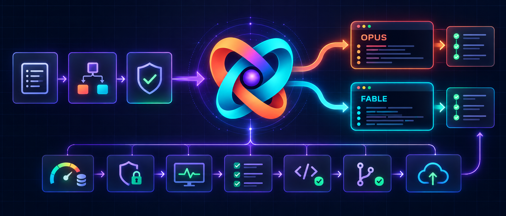

# OpenAInthropic



**Codex com Opus e Fable.** OpenAInthropic é a marca visível desta integração local independente para coordenar tarefas do Claude Code a partir do Codex, com planejamento aprovado, responsáveis explícitos, permissões mínimas, acompanhamento ao vivo e retomada controlada. Não é um produto oficial nem representa parceria entre OpenAI e Anthropic.

O identificador técnico permanece `claude-code-live`, preservando instalações, comandos, caminhos, automações e sessões existentes.

O pacote instalável fica em [`outputs/claude-code-live`](outputs/claude-code-live/README.md). O diretório `work/`, quando existir, contém somente artefatos locais de validação e não faz parte do repositório.

## O que o plugin faz

- Escolhe entre execução local controlada e sessão em nuvem do Claude Code.
- Exige planejamento e uma matriz de responsáveis antes de implementação ou mutação.
- Separa leitura, verificação por comandos e edição em modos diferentes.
- Limita ferramentas e comandos por allowlist explícita.
- Mantém um painel e uma sessão Claude independentes para cada tarefa Codex.
- Pode selecionar Fable ou Opus antes de iniciar ou retomar, conforme limites confirmados pelo `/usage`.
- Permite interromper e retomar uma sessão sem repetir mutações automaticamente.
- Mantém commit, push, PR, deploy, publicação e outras mutações externas fora do Claude.
- Obriga o Codex a revisar artefatos e testes; término do processo não equivale a aceite.

## Fluxo obrigatório antes da execução

Quando a skill `claude-code-live` for usada, o Codex:

1. Inspeciona somente em leitura o necessário para preparar um plano realista.
2. Apresenta o plano e uma matriz com as oito responsabilidades.
3. Aguarda aprovação explícita do usuário.
4. Executa somente as etapas atribuídas ao Claude e apenas com as ferramentas autorizadas.
5. Revisa o diff, os testes e os artefatos independentemente.

Silêncio, envio do plano ou autorização de outra tarefa não contam como aprovação. Se surgir uma ação não prevista ou mudar plano, escopo ou responsável, a execução deve parar para uma nova decisão.

### Matriz de responsáveis

Cada linha recebe exatamente um ator: `codex`, `claude`, `user` ou `not_applicable`.

| Responsabilidade | Abrange |
|---|---|
| `planning` | Planejamento e critérios de aceite |
| `inspection` | Leitura e diagnóstico do projeto |
| `implementation` | Criação ou edição de arquivos |
| `testing` | Testes, builds e verificações permitidas |
| `review` | Revisão técnica e decisão de aceite |
| `commit` | Criação de commits Git |
| `push` | Push e abertura ou merge de PR |
| `deploy` | Deploy, publicação e outras mutações externas |

Claude nunca pode ser responsável por `commit`, `push` ou `deploy`. Essas linhas aceitam somente `codex`, `user` ou `not_applicable`.

## Modos locais

| Modo | Ferramentas | Uso |
|---|---|---|
| `chat` | Nenhuma | Discussão sem acesso ao projeto |
| `read` | `Read`, `Glob`, `Grep` | Planejamento, inspeção e diagnóstico sem comandos |
| `verify` | Leitura e Bash explicitamente permitido | Testes ou inspeções por comando, sem `Write` ou `Edit` |
| `local` | Leitura, `Write`, `Edit` e Bash explicitamente permitido | Implementação atribuída ao Claude |

Todos os modos usam `dontAsk`, `--permission-prompts none` e allowlist. Uma ação fora do contrato é negada e não fica aguardando aprovação invisível.

Perfis disponíveis:

- `restricted`: preferencial para alterações, com `--restricted`, safe mode, MCP estrito e diretório de trabalho limitado.
- `diagnostic`: diagnóstico ou ambiente limpo sem personalizações; não é um sandbox do sistema operacional.

## Contrato do job

Campos principais:

- `workspace`: caminho absoluto autorizado.
- `promptFile`: prompt completo, sem segredos ou PII.
- `mode`: `chat`, `read`, `verify` ou `local`.
- `profile`: `diagnostic` ou `restricted`.
- `model`: opcional; padrão `fable`. Não combine com `modelPolicy`.
- `modelPolicy`: política opcional e explícita de seleção por quota; sem ela, o comportamento de modelo fixo permanece inalterado.
- `effort`: `low`, `medium`, `high`, `xhigh` ou `max`; padrão `high`.
- `coordination`: plano, aprovação e matriz obrigatórios.
- `allowedCommands`: objetos com regra Bash exata e responsabilidade correspondente.
- `resumeFrom`: caminho para um `resultado.json` anterior do mesmo workspace.
- `codexThreadId`: fallback opcional para execução fora do Codex; dentro do Codex, `CODEX_THREAD_ID` é usado automaticamente.
- `timeoutSeconds`: tempo limite; padrão de 1800 segundos.

Exemplo de testes sem conceder edição ao Claude:

```json
{
  "workspace": "C:\\projeto-autorizado",
  "promptFile": "C:\\execucoes\\prompt.md",
  "mode": "verify",
  "profile": "restricted",
  "coordination": {
    "phase": "execution",
    "scopeId": "validar-correcao",
    "approvalRevision": 1,
    "planSummary": "Executar os testes aprovados sem editar arquivos.",
    "planApproved": true,
    "responsibilities": {
      "planning": "codex",
      "inspection": "claude",
      "implementation": "codex",
      "testing": "claude",
      "review": "codex",
      "commit": "not_applicable",
      "push": "not_applicable",
      "deploy": "not_applicable"
    }
  },
  "allowedCommands": [
    {
      "rule": "Bash(pwsh -NoProfile -File tests.ps1)",
      "responsibility": "testing"
    }
  ]
}
```

### Seleção opcional por quota

Ative a política somente nos jobs em que a troca automática foi aprovada:

```json
{
  "modelPolicy": {
    "mode": "quota-aware",
    "primary": "fable",
    "alternate": "opus",
    "switchAtRemainingPercent": 3
  }
}
```

`switchAtRemainingPercent` é opcional, usa `3` por padrão e aceita inteiros de `1` a `20`. A política é deliberadamente assimétrica:

- Fable efetivo acima do limite: usa `fable`.
- Fable efetivo no limite ou abaixo, com capacidade compartilhada acima dele: usa `opus`.
- Sessão ou semana geral no limite ou abaixo: bloqueia; trocar para Fable não recuperaria capacidade compartilhada.
- Falha ou formato inesperado em `/usage`: bloqueia o job quota-aware antes de iniciar o Claude.

A capacidade compartilhada é o menor restante entre sessão e semana geral. O restante efetivo do Fable é o menor entre essa capacidade e o limite próprio do Fable. A escolha é recalculada a cada início ou retomada; depois da renovação do Fable, o job volta ao modelo primário. Isso não usa `--fallback-model`, que trata indisponibilidade/sobrecarga e não quota.

O painel, `status.json` e `resultado.json` registram política, percentuais sanitizados, modelo solicitado, modelo selecionado e motivo. Alterar política ou limite ao retomar exige nova aprovação e `approvalRevision` maior.

### Fases e aprovação

- `planning` aceita somente `chat` ou `read`; a matriz já existe, mas o plano final pode não estar aprovado.
- `execution` exige `planApproved: true`, resumo não vazio e as oito responsabilidades.
- `local` exige que `implementation` pertença ao Claude.
- Cada comando exige que a responsabilidade indicada pertença ao Claude.
- `verify` aceita comandos apenas de `inspection` ou `testing`.
- `local` aceita comandos apenas de `inspection`, `implementation` ou `testing`.

O validador bloqueia regras que revelem commit, push, criação ou merge de PR, deploy ou publicação, mesmo quando rotuladas como outra responsabilidade. Scripts permitidos devem ser inspecionados antes; classificação textual não substitui revisão de conteúdo.

## Execução e acompanhamento local

```powershell
pwsh -NoProfile -File '<plugin>\skills\claude-code-live\scripts\start-live.ps1' `
  -JobFile '<job.json>' `
  -RunDirectory '<pasta-nova>'
```

O preflight valida o contrato antes de abrir o painel ou iniciar o Claude. Cada tarefa Codex possui diretório de estado, painel e mutex próprios; jobs da mesma tarefa são serializados, enquanto tarefas diferentes podem executar simultaneamente. A consulta de quota continua protegida por um mutex global porque os limites pertencem à conta, não à tarefa.

O painel mostra modo, perfil, modelo efetivo, fase, escopo, revisão aprovada, resumo do plano, responsáveis, limites de uso sanitizados, ferramentas e mudanças de estado.

Pressione `Q` para solicitar parada. `X` ou fechar o painel encerra apenas a visualização. `Ctrl+C` no executor tenta encerrar o processo filho e seus descendentes.

Cada pasta de execução preserva:

- `acompanhamento.txt`: saída pública acompanhável.
- `status.json`: estado corrente sanitizado.
- `resultado.json`: resultado, sessão, contrato, ferramentas e contadores.
- `stop.request`: solicitação de interrupção, quando criada.

`FAIL`, `BLOCKED`, `CANCELLED` e `TIMEOUT` nunca são sucesso. `COMPLETED` confirma apenas que o CLI terminou.

## Retomada

Dentro da mesma tarefa Codex, o plugin retoma automaticamente a última sessão Claude somente quando thread, workspace, modo, perfil, effort, modelo/política, plano, revisão, responsáveis e comandos autorizados são idênticos. A ordem dos comandos não altera a compatibilidade. Caso contrário inicia uma sessão nova.

Use `resumeFrom` para uma retomada explícita no mesmo workspace. Resultados vinculados a outra tarefa Codex são rejeitados. Comandos alterados ou resultados legados sem `allowedCommands` exigem revisão de aprovação maior para retomada explícita; resultados sem esse registro nunca são retomados automaticamente.

- Sem mudança, preserve `scopeId`, `approvalRevision`, plano e matriz.
- Com mudança, obtenha nova aprovação e aumente `approvalRevision`.
- Resultado antigo ou parcial sem contrato completo não pode ser retomado.
- Tarefa nova, mudança material de escopo ou contexto contaminado exige outra sessão.
- Retomar não desfaz edições nem repete ferramentas; reinspecione o estado primeiro.

## Sessões na nuvem

O mesmo plano, matriz e aprovação são obrigatórios antes de criar ou retomar uma sessão em nuvem. O prompt remoto contém somente as etapas atribuídas ao Claude.

O runner local não controla o backend de nuvem; o Codex aplica a matriz no prompt e na revisão. O repositório e os dados necessários devem existir previamente no ambiente remoto autorizado. Não use nuvem para transportar credenciais, `.env`, PII, perfis reais ou payloads sensíveis.

Sessões em nuvem e tarefas locais em segundo plano são backends diferentes. Não combine `--cloud` com o fluxo local administrado por `agents`, `logs`, `attach`, `stop` ou `rm`.

## Segurança e limites

A skill não amplia a autorização do pedido. Ela não concede permissão para instalar ou atualizar software, acessar banco ou provedor, criar ambientes, ampliar diretórios, fazer commit, push, PR, publicação ou deploy.

Não coloque em prompt, job, log ou sessão remota tokens, senhas, cookies, chaves privadas, `.env`, dados reais de clientes, perfis administrativos ou payloads brutos de provedores.

Safe mode, perfil restrito e allowlists reduzem a superfície de acesso, mas não são sandbox completo de rede ou sistema operacional. O Codex valida o resultado no repositório e no ambiente autorizado.

## Estrutura do repositório

- `outputs/claude-code-live/.codex-plugin/plugin.json`: manifesto.
- `outputs/claude-code-live/skills/claude-code-live/SKILL.md`: regras principais.
- `outputs/claude-code-live/skills/claude-code-live/references/`: operação local, nuvem e segurança.
- `outputs/claude-code-live/skills/claude-code-live/scripts/`: contrato, executor, painel e consulta de uso.
- `outputs/claude-code-live/skills/claude-code-live/tests/`: testes contratuais e do parser.
- `outputs/claude-code-live/scripts/`: validação e smoke test.
- `docs/superpowers/plans/`: planos históricos.

## Instalação

O Codex instala plugins por marketplace. Este projeto não altera marketplaces automaticamente.

1. Coloque `outputs/claude-code-live` em `plugins/claude-code-live` do marketplace autorizado.
2. Adicione ou valide a entrada usando o fluxo oficial de `plugin-creator`.
3. Para marketplace não padrão, execute `codex plugin marketplace add <raiz>`.
4. Execute `codex plugin add claude-code-live@<marketplace>`.
5. Abra uma nova tarefa para carregar a versão instalada.

O marketplace pessoal padrão em `~/.agents/plugins/marketplace.json` é descoberto implicitamente e não exige `marketplace add`.

## Atualização

Após editar e validar:

1. Use `update_plugin_cachebuster.py`, da skill `plugin-creator`, para atualizar o sufixo de cache.
2. Reinstale com `codex plugin add claude-code-live@<marketplace>`.
3. Teste em uma nova tarefa.

Não edite `marketplace.json` manualmente.

## Validação

```powershell
pwsh -NoProfile -File '.\outputs\claude-code-live\scripts\validate.ps1'
pwsh -NoProfile -File '.\outputs\claude-code-live\scripts\smoke-test.ps1'
```

O smoke test valida contrato, parser de uso, presença do Claude CLI e opções necessárias sem autenticar ou iniciar sessão Claude. Inclui testes com CLI simulado para concorrência, cancelamento isolado, retomada, falhas de preparação e leitura incremental UTF-8. Fluxos reais de permissão, interrupção, retomada ou nuvem exigem projeto descartável e autorização específica.

### Confiabilidade do executor e do painel

O executor grava `STARTING` antes das consultas externas. Falhas de preparação produzem resultado terminal sanitizado com `failureStage`; não substituem o ponteiro da última sessão confirmada pelo CLI. `startedAt` permite que o painel calcule o tempo decorrido mesmo sem eventos novos.

`usageCheckedAt` registra o horário da tentativa de consulta inicial. A capacidade não é monitorada continuamente: é reavaliada em cada início ou retomada, sem interromper uma execução longa para trocar de modelo. O painel identifica a tarefa no título e lê somente novos bytes do log, preservando caracteres UTF-8 e reiniciando a leitura na troca de execução ou truncamento detectado.

Os parâmetros `TestAdapter`, `TestStateRoot` e `NoPanel` são exclusivos do harness de testes. O adaptador é um script local confiável executado pelo coordenador, nunca um campo do job. O harness usa processos simulados e estado temporário; `TestStateRoot` e `NoPanel` exigem adaptador explícito.

## Compatibilidade

Esta revisão altera intencionalmente o contrato:

- jobs sem `coordination` são rejeitados;
- `allowedCommands` passa de strings para objetos `{ rule, responsibility }`;
- resultados antigos sem coordenação completa não podem ser retomados;
- `verify` passa a ser o modo para comandos sem edição.

Crie um novo job com plano e matriz aprovados para migrar uma execução antiga.
