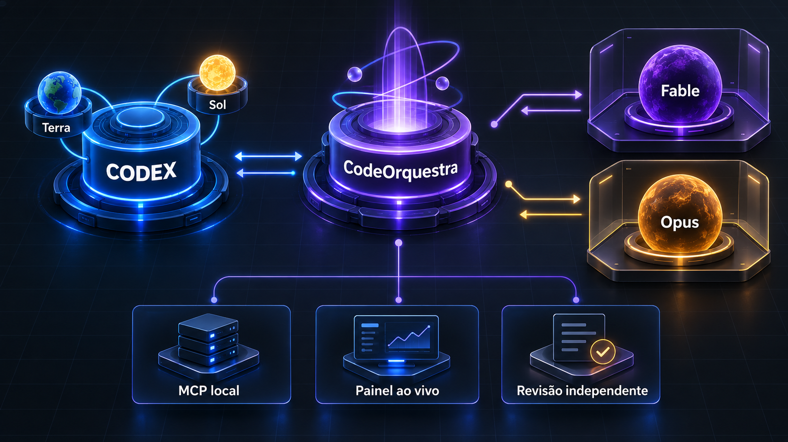
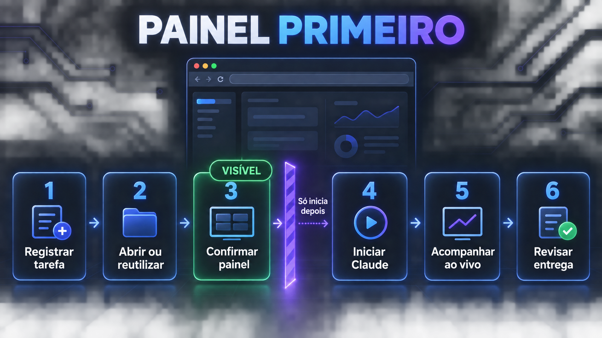

# CodeOrquestra



**Codex com Opus e Fable.** CodeOrquestra é a marca visível desta integração local independente para coordenar o Claude Code que você já instalou, local ou em nuvem. Modelos Codex, como Terra e Sol, podem usar sua capacidade de planejamento, supervisão e revisão para gerenciar sessões separadas do Claude Opus e Fable, sempre com responsáveis explícitos, permissões mínimas, acompanhamento e retomada controlados. Os modelos disponíveis dependem da configuração da conta e podem mudar. Não é um produto oficial nem representa parceria entre OpenAI e Anthropic.

Identificador técnico: `codeorquestra`. O alias legado `claude-code-live` continua documentado e em uso nos nomes de skill, diretórios de estado e arquivos derivados, preservando instalações, comandos, caminhos, automações e sessões existentes.

Duas gerações convivem neste pacote:

| | Runner legado (v1) | Runtime v2 |
|---|---|---|
| Onde | `skills/claude-code-live/scripts/*.ps1` | `runtime/` (Node 22+, TypeScript) |
| Contrato | job v1 (`mode`, `allowedCommands`, `timeoutPolicy`) | job v2 (`contractVersion: 2`, `profile`, `capabilities` derivadas) |
| Interação | uma execução, painel de console, sem prompts | sessão durável multiturno, fila de orientações, permissões e perguntas ao vivo, painel web |
| Superfícies | PowerShell | broker HTTP em loopback + MCP stdio + CLI + painel |

O v1 continua suportado sem alterações de escopo. O restante deste documento descreve o v1; o v2 está em [`runtime/README.md`](runtime/README.md).

## Fluxo obrigatório

Antes de implementação ou mutação, o Codex:

1. inspeciona somente em leitura;
2. apresenta o plano;
3. atribui `planning`, `inspection`, `implementation`, `testing`, `review`, `commit`, `push` e `deploy` a `codex`, `claude`, `user` ou `not_applicable`;
4. aguarda aprovação explícita;
5. executa apenas as etapas atribuídas ao Claude e revisa os resultados independentemente.

Claude nunca pode receber `commit`, `push` ou `deploy`. `deploy` também representa publicação e outras mutações externas. Mudanças de plano, escopo ou responsável exigem nova aprovação.

## Modos

| Modo | Ferramentas | Finalidade |
|---|---|---|
| `chat` | Nenhuma | Conversa sem acesso ao projeto |
| `read` | `Read`, `Glob`, `Grep` | Planejamento e inspeção |
| `verify` | Leitura e Bash exato | Testes sem `Write` ou `Edit` |
| `local` | Leitura, `Write`, `Edit` e Bash exato | Implementação atribuída ao Claude |

Todos usam `dontAsk`, `--permission-prompts none` e allowlist. O perfil `restricted` é preferido para alterações; `diagnostic` existe para diagnóstico ou ambientes limpos. Nenhum perfil é sandbox completo do sistema operacional.

## Contrato do job

```json
{
  "workspace": "C:\\projeto-autorizado",
  "promptFile": "C:\\execucoes\\prompt.md",
  "mode": "verify",
  "profile": "restricted",
  "coordination": {
    "phase": "execution",
    "scopeId": "validar-correcao",
    "approvalRevision": 1,
    "planSummary": "Executar os testes aprovados sem editar arquivos.",
    "planApproved": true,
    "responsibilities": {
      "planning": "codex",
      "inspection": "claude",
      "implementation": "codex",
      "testing": "claude",
      "review": "codex",
      "commit": "not_applicable",
      "push": "not_applicable",
      "deploy": "not_applicable"
    }
  },
  "allowedCommands": [
    {
      "rule": "Bash(pwsh -NoProfile -File tests.ps1)",
      "responsibility": "testing"
    }
  ],
  "timeoutPolicy": {
    "mode": "adaptive",
    "renewEverySeconds": 1800,
    "idleAfterSeconds": 1200,
    "hardStopAfterSeconds": 7200
  }
}
```

- `planning` aceita apenas `chat` ou `read` e ainda não exige plano final aprovado.
- `execution` exige resumo, aprovação e matriz completa.
- `local` exige que `implementation` pertença ao Claude.
- `verify` aceita comandos somente de `inspection` ou `testing`.
- `local` aceita comandos somente de `inspection`, `implementation` ou `testing`.
- Cada comando exige que Claude seja o ator da responsabilidade indicada.
- Regras que revelem commit, push, criação ou merge de PR, deploy ou publicação são bloqueadas.

Scripts permitidos ainda precisam ser inspecionados. A trava textual não substitui revisão do conteúdo executado.

Se `timeoutPolicy` for omitido, esses mesmos valores adaptativos são usados por padrão. Cada evento JSON válido renova a evidência de atividade; 20 minutos sem eventos encerram por `inactivity`, e 2 horas encerram por `hard_limit` mesmo com atividade. A preparação não consome esse relógio. Para compatibilidade, `timeoutSeconds` ainda define um limite fixo positivo, mas não pode ser combinado com `timeoutPolicy`. Um `TIMEOUT` preserva sessão, arquivos e logs para revisão; nunca inicia outra execução automaticamente.

## Seleção opcional por quota

Jobs sem `modelPolicy` continuam usando o modelo fixo de `model` (ou Fable por padrão). Para permitir a troca automática antes de iniciar ou retomar:

```json
"modelPolicy": {
  "mode": "quota-aware",
  "primary": "fable",
  "alternate": "opus",
  "switchAtRemainingPercent": 3
}
```

Não combine `model` e `modelPolicy`. O limite padrão é `3` e aceita inteiros de `1` a `20`. Fable é mantido acima do limite; Opus é usado quando apenas o restante efetivo do Fable chega ao limite; sessão ou semana geral baixas bloqueiam a execução. Falha ou formato inesperado em `/usage` também bloqueia um job quota-aware antes de iniciar o Claude.

A decisão é refeita a cada início/retomada e volta ao Fable após a renovação. O painel, `status.json` e `resultado.json` mostram somente política, percentuais sanitizados, modelo solicitado/selecionado e motivo. Alterar a política em uma retomada exige `approvalRevision` maior. O recurso não usa `--fallback-model`, pois esse fallback cobre indisponibilidade/sobrecarga, não quota.

## Executar localmente



```powershell
pwsh -NoProfile -File '<plugin>\skills\claude-code-live\scripts\start-live.ps1' `
  -JobFile '<job.json>' `
  -RunDirectory '<pasta-nova>'
```

No runner legado, o contrato é validado antes de preparar o painel e o processo; o handshake de prontidão do painel precisa terminar antes de o processo Claude começar. No runtime v2 o broker recusa iniciar sem canal de acompanhamento declarado: com `observation.mode: "painel"` (o padrão) ele verifica que existe assinante do fluxo de eventos daquela tarefa e responde `OBSERVATION_REQUIRED` quando não há; com `observation.mode: "voz"` o coordenador assume explicitamente o acompanhamento narrado, e a escolha fica registrada em `run_started`. A contagem prova que **um canal está anexado**, não que alguém está olhando: uma aba em segundo plano conta. O painel mostra modo, perfil, modelo, fase, escopo, revisão, resumo, responsáveis, renovações do tempo adaptativo e consumo separado por fonte.

O medidor híbrido do runtime v2 mostra tokens Claude reportados pelo CLI (inclusive leitura e criação de cache), estimativa da tarefa Codex quando disponível, limites Codex e atividade da conta. Dados ausentes aparecem como `parcial` ou `indisponível`; estimativas permanecem identificadas e nunca são somadas ao Claude como custo. O acesso ao Codex é somente leitura por uma conexão local com o App Server, sem abrir arquivos de autenticação, iniciar inferência ou resgatar créditos. Atualize pelo painel ou por `codeorquestra_usage_refresh`; uma falha nesse medidor não interfere no trabalho Claude.

Cada tarefa Codex usa `CODEX_THREAD_ID` para manter diretório, painel, mutex e sessão Claude próprios. Jobs da mesma tarefa são serializados; tarefas diferentes podem executar ao mesmo tempo. A leitura de quota permanece globalmente serializada. Fora do Codex, `codexThreadId` fornece uma identidade estável opcional; sem identidade, cada chamada recebe uma chave isolada de uso único.

Antes de toda execução v2 no modo `painel`, o Codex gera o link limitado da tarefa e abre ou reutiliza uma única aba; o broker só aceita iniciar depois que essa aba está de fato assinando os eventos. Sem canal declarado nem assinante, a execução é recusada em vez de começar em silêncio. Uma segunda estratégia de abertura não é disparada enquanto a primeira estiver pendente, evitando abas duplicadas.

Cada execução preserva `acompanhamento.txt`, `status.json` e `resultado.json`. Pressione `Q` para interromper; `X` fecha apenas o painel. `COMPLETED` indica término do CLI, não aceite técnico.

## Retomar

O plugin retoma automaticamente a última sessão da mesma tarefa apenas quando toda a configuração aprovada continua idêntica. Mudança de workspace, escopo, revisão, responsáveis, modo, perfil, effort, modelo ou comandos autorizados inicia uma sessão nova. A lista de comandos e responsabilidades é normalizada e ordenada no resultado.

Use `resumeFrom` para retomada explícita no mesmo workspace. Uma sessão vinculada a outra tarefa Codex é rejeitada. Mudança de comandos ou resultado legado sem `allowedCommands` exige revisão maior na retomada explícita. Sem esse campo, a retomada automática é desabilitada.

- Sem mudança, mantenha `scopeId`, `approvalRevision`, plano e matriz.
- Qualquer mudança exige nova aprovação e revisão maior.
- Resultados antigos sem coordenação completa não podem ser retomados.
- Reinspecione o estado; a retomada não desfaz edições.

## Nuvem

O mesmo plano e matriz são obrigatórios. Envie somente as etapas atribuídas ao Claude. O runner local não controla o backend remoto, então o Codex preserva as restrições no prompt e na revisão.

Não use nuvem para transportar credenciais, `.env`, PII, perfis reais ou payloads sensíveis. Sessão em nuvem e tarefa local em segundo plano são fluxos distintos.

## Segurança

A skill não autoriza instalação, acesso a banco ou provedor, novos ambientes, diretórios adicionais, commit, push, PR, publicação ou deploy. Nunca inclua tokens, senhas, cookies, chaves, `.env`, dados reais de clientes ou payloads brutos em prompts, jobs ou logs.

Safe mode, perfis e allowlists reduzem acesso, mas não substituem revisão nem isolamento de sistema operacional.

## Conteúdo

- `.codex-plugin/plugin.json`: manifesto (`displayName` CodeOrquestra; `name` permanece `claude-code-live` como alias legado).
- `.mcp.json`: registra no Codex o adaptador MCP `codeorquestra` empacotado no runtime.
- `skills/claude-code-live/SKILL.md`: contrato principal.
- `skills/claude-code-live/references/`: guias local (v1), nuvem, segurança e `runtime-v2.md` (sessão durável, broker local e ferramentas MCP).
- `skills/claude-code-live/scripts/`: executor, painel, contrato e consulta de uso (v1).
- `skills/claude-code-live/tests/`: testes automatizados do v1.
- `runtime/`: runtime v2 (broker, worker por tarefa, MCP stdio, CLI e painel web) — ver `runtime/README.md`.
- `assets/`: ícone, visão de arquitetura e fluxo visual de painel primeiro.
- `scripts/validate.ps1`: validação estrutural.
- `scripts/smoke-test.ps1`: validação completa sem iniciar sessão Claude.

## Como o Claude Code é acionado

Em ambas as gerações, o Claude Code **não é empacotado aqui**: o pacote resolve e controla a instalação que já existe na máquina. O v2 vai além e conversa diretamente com o processo do CLI instalado pelo protocolo `stream-json` documentado, sem importar nem redistribuir o Agent SDK. Se a build instalada não anunciar as flags de que o runtime depende, a execução não inicia e o motivo é reportado; nenhum CLI alternativo é usado como substituto.

## Instalar

O Codex instala plugins por marketplace. Este pacote não altera marketplaces automaticamente.

1. Coloque a pasta sob `plugins/claude-code-live` do marketplace autorizado.
2. Adicione ou valide a entrada usando `plugin-creator`.
3. Em marketplace não padrão, execute `codex plugin marketplace add <raiz>`.
4. Execute `codex plugin add claude-code-live@<marketplace>`.
5. Abra uma nova tarefa para carregar a versão instalada.

Na tarefa nova, as ferramentas `codeorquestra_*` ficam disponíveis ao Codex. O adaptador MCP inicia ou reutiliza o broker em loopback; ele não cria uma sessão Claude compartilhada. Cada tarefa registra seu próprio `taskHandle`, e o broker mantém um worker e uma identidade Claude separados para cada tarefa.

O marketplace pessoal padrão em `~/.agents/plugins/marketplace.json` é descoberto automaticamente.

## Atualizar

Valide a fonte, atualize o cachebuster com o helper de `plugin-creator`, reinstale e teste em nova tarefa. Não edite `marketplace.json` manualmente.

## Validar

```powershell
pwsh -NoProfile -File '<plugin>\scripts\validate.ps1'
pwsh -NoProfile -File '<plugin>\scripts\smoke-test.ps1'
```

O smoke test não autentica nem inicia sessão Claude. Um CLI simulado verifica concorrência, cancelamento isolado, retomada, falhas de preparação, renovação adaptativa, inatividade, teto absoluto e limite fixo legado. O leitor incremental é testado com UTF-8 dividido entre escritas, truncamento e troca de log. Testes reais de permissões, interrupção, retomada ou nuvem exigem projeto descartável e autorização específica.

O estado inicial é gravado antes da consulta de uso. Falhas de preparação deixam estado terminal com `failureStage` sanitizado e preservam a última sessão confirmada. `startedAt` alimenta o tempo decorrido no título do painel; `usageCheckedAt` data a tentativa de consulta inicial. Os limites são reavaliados em cada início/retomada, sem troca no meio da execução. O painel identifica a tarefa e lê somente os novos bytes do log.

`TestAdapter` é um script local confiável, exclusivo do harness; não pode ser fornecido pelo job. `TestStateRoot` e `NoPanel` requerem adaptador explícito. Os testes usam estado temporário e não consultam a conta Claude.

## Migração

Jobs sem `coordination` são rejeitados. `allowedCommands` agora usa objetos `{ rule, responsibility }`, e resultados anteriores sem contrato completo não podem ser retomados. Crie um novo job com plano e matriz aprovados.
